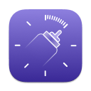

### Hello! :wave:

I'm Jonas! I'm a developer from 🇸🇪 Stockholm. I mostly build  **Flutter** and  **Android** things!

🔭 You can reach me on  [LinkedIn](https://linkedin.com/in/jonasborggren) or  [stackoverflow](https://stackoverflow.com/users/3064486/jonas-borggren)

#### Projects

#### Statistics
<picture>
  <source media="(prefers-color-scheme: dark)" srcset="https://github-readme-stats.vercel.app/api?username=jonasborggren&show_icons=true&include_all_commits=true&hide=stars&theme=icegray&bg_color=00000000&hide_title=true&border_color=30363d&text_color=c9d1d9&title_color=c9d1d9&icon_color=58a6ff&ring_color=58a6ff&layout=compact&count_private=true">
  
</picture>
